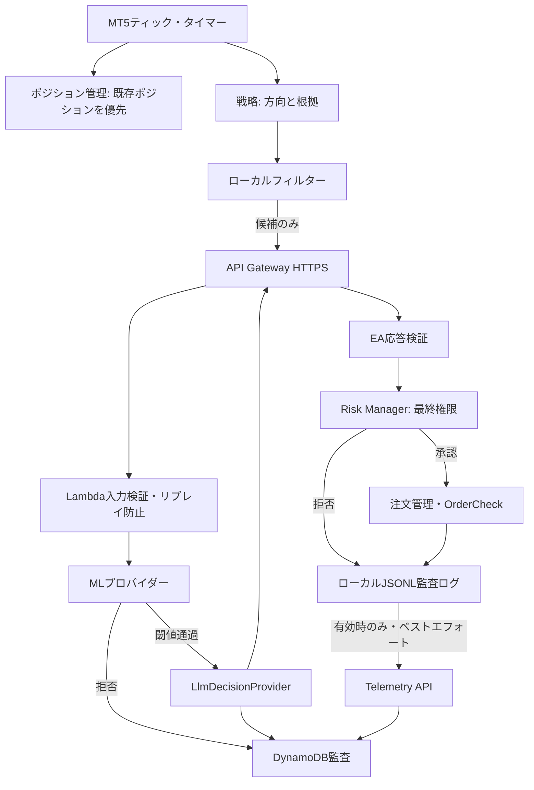

# アーキテクチャ

## 現状分析と仮定

開始時点の作業ディレクトリは空で、Gitも未初期化だった。既存コード・互換性制約・既存テストはない。以下を初期仮定とする。

- 初期対象はUSDJPY、1口座、1戦略、ネッティング・ヘッジ双方に耐える設計（実装時に口座モードを検査）
- シグナル評価はH1確定足につき最大1回。ティックごとにAPIを呼ばない
- 口座通貨はJPYを初期想定するが、損失額計算は口座通貨へ換算された `OrderCalcProfit` を優先する
- AWSリージョンは設定値。productionはdevと認証情報・データを分離する
- AWS・LLMは補助フィルターであり、利用不能でも既存ポジション保護はEA単独で継続する

## コンポーネント

リスク管理コンポーネント（Risk Manager）は決定経路の最終権限を持つ。戦略、ML、LLMが承認しても、Risk Managerが拒否すれば発注しない。外部サービスの結果は「短時間有効な候補承認」であり、発注権限ではない。

## データフロー

候補状態は `DETECTED → LOCAL_FILTERED → ML_REJECTED | LLM_VETOED | EXTERNAL_ALLOWED → RISK_REJECTED | ORDER_SUBMITTED → FILLED | FAILED → CLOSED` と遷移する。すべてを `trade_candidate_id` で相関させる。状態は単調に進め、同じ要求IDは同じ結果を返す（冪等性）。

EAは確定足、待機時間、同方向ポジション有無を先に検査する。API応答後には価格、スプレッド、口座状態が変わり得るため、Risk Managerが最新値で再計算する。期限切れ応答は拒否する。

## AWS構成

- API Gateway HTTP API: REST APIより低コスト。WAFは初期必須にせず、必要性と費用を監視
- Lambda: APIオーケストレーション、入力検証、ML推論、LLMアダプター
- DynamoDBオンデマンド: 単一テーブルを基本に候補・決定・注文イベントを保存。TTLは冪等キー等の短期データだけに使用
- S3: モデル、バックテスト成果物、長期レポート。バージョニングと暗号化
- CloudWatch: メトリクス、構造化エラーログ、アラーム。保持期間を環境別に設定
- SSM Parameter Store SecureString: 低頻度・小規模なLLM API秘密情報。自動ローテーションが必要になった時だけSecrets Managerを使用

常時稼働サーバー、RDS、NAT Gatewayは初期構成に含めない。LambdaをVPCに入れず、NATの固定費を避ける。

## データモデル

Phase 9の単一テーブルは、認証nonceを `pk=AUTH#<key_id>` / `sk=NONCE#<nonce>`、判断を `pk=REQUEST#<request_id>` / `sk=DECISION`、取引イベントを `pk=SOURCE#<source_id>` / `sk=EVENT#<UTC時刻>#<event_id>` で保存する。`source_id` は環境、key ID、EA IDから作るSHA-256派生値で、口座ログイン番号を保存しない。

候補横断照会には `candidate-index` を使用し、`gsi1pk=CANDIDATE#<trade_candidate_id>`、`gsi1sk=DECISION|EVENT#...` とする。nonceだけにDynamoDB TTLを設定し、判断と取引監査は永続データとして保持する。判断の `idempotency_expires_at` は再利用期限を示す監査属性で、削除TTLではない。

EAは端末ログに加えて日別JSONLへ先に追記する。Telemetry API送信は設定で明示的に有効化した場合だけ行い、失敗しても発注結果や既存ポジション管理を変更しない。Phase 9時点では自動再送キューを持たないため、JSONLを保全して手動調査・将来の再送処理に利用する。

## 失敗時ポリシー

タイムアウト、HTTP非2xx、スキーマ不一致、要求ID不一致、期限切れ、ML/LLM例外、不正な判断値、Risk計算不能は新規注文を拒否する。キャッシュ済みALLOWを別候補へ流用しない。外部障害による拒否後の即時再試行発注は行わない。
