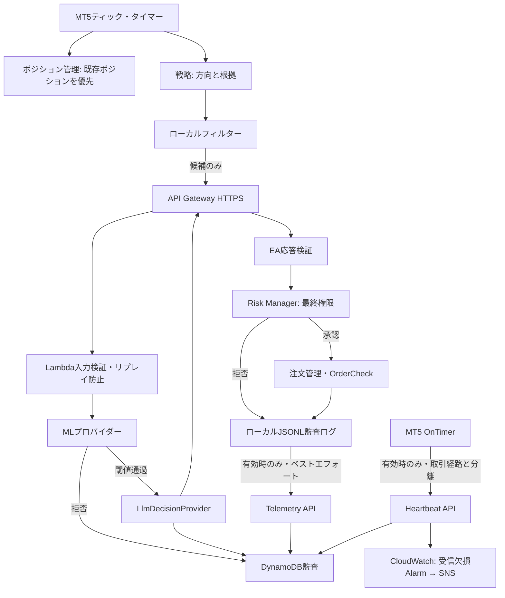

# アーキテクチャ

## 現状分析と仮定

開始時点の作業ディレクトリは空で、Gitも未初期化だった。既存コード・互換性制約・既存テストはない。以下を初期仮定とする。

- 初期対象はUSDJPY、1口座、1戦略、ネッティング・ヘッジ双方に耐える設計（実装時に口座モードを検査）
- シグナル評価はH1確定足につき最大1回。ティックごとにAPIを呼ばない
- 口座通貨はJPYを初期想定するが、損失額計算は口座通貨へ換算された `OrderCalcProfit` を優先する
- AWSリージョンは設定値。productionはdevと認証情報・データを分離する
- AWS・LLMは補助フィルターであり、利用不能でも既存ポジション保護はEA単独で継続する

## コンポーネント

リスク管理コンポーネント（Risk Manager）は決定経路の最終権限を持つ。戦略、ML、LLMが承認しても、Risk Managerが拒否すれば発注しない。外部サービスの結果は「短時間有効な候補承認」であり、発注権限ではない。

## データフロー

候補状態は `DETECTED → LOCAL_FILTERED → ML_REJECTED | LLM_VETOED | EXTERNAL_ALLOWED → RISK_REJECTED | ORDER_SUBMITTED → FILLED | FAILED → CLOSED` と遷移する。すべてを `trade_candidate_id` で相関させる。状態は単調に進め、同じ要求IDは同じ結果を返す（冪等性）。

EAは確定足、待機時間、同方向ポジション有無を先に検査する。API応答後には価格、スプレッド、口座状態が変わり得るため、Risk Managerが最新値で再計算する。期限切れ応答は拒否する。

## AWS構成

- API Gateway HTTP API: REST APIより低コスト。WAFは初期必須にせず、必要性と費用を監視
- Lambda: APIオーケストレーション、入力検証、ML推論、LLMアダプター
- DynamoDBオンデマンド: 単一テーブルを基本に候補・決定・注文イベントを保存。TTLは冪等キー等の短期データだけに使用
- S3: モデル、バックテスト成果物、長期レポート。バージョニングと暗号化
- CloudWatch: メトリクス、構造化エラーログ、アラーム。保持期間を環境別に設定
- SSM Parameter Store SecureString: 低頻度・小規模なLLM API秘密情報。自動ローテーションが必要になった時だけSecrets Managerを使用

常時稼働サーバー、RDS、NAT Gatewayは初期構成に含めない。LambdaをVPCに入れず、NATの固定費を避ける。

SSM SecureString（HMAC共有鍵・LLM APIキー）はLambda実行環境の再利用中だけTTL付きでメモリ保持する（既定300秒、CDK context `secret_cache_ttl_seconds`、0で無効）。取得失敗・長さ不正の値はキャッシュせず、認証は従来どおり401でFail Closedとなる。同一Parameterの値を上書きした場合、最大TTL秒は旧値が使われ得るため、鍵ローテーションは新しいkey IDの追加で行う（`docs/security.md`）。

## タイムアウト予算（2026-09-26追加）

外部判断は次の順序を満たすよう設定し、CDK synth時に `validate_timeout_budget` で検証する。

| 層 | 既定値 | 役割 |
|---|---:|---|
| LLM provider timeout（`LLM_TIMEOUT_SECONDS`） | 3.0秒 | LLM呼出しの合計経過時間上限。urllibの操作単位timeoutに加え、応答受信後に合計時間を再検査し超過はVETO |
| LLM後の予備（`LLM_DEADLINE_RESERVE_SECONDS`） | 0.5秒 | 監査保存・応答生成 |
| Decision deadline（`DECISION_DEADLINE_SECONDS`） | 4.0秒 | Handler開始からの応答期限。残り時間（Lambda残り時間とも比較）がLLM timeout + 予備未満ならLLMを呼ばず `VETO / LLM_INFERENCE_ERROR` |
| EA WebRequest（`InpDecisionApiTimeoutMs`） | 4.5秒 | 超過時はEA側でVETO |
| API Gateway integration | 5.0秒 | 超過時は5xx → EA側VETO |
| Lambda timeout | 5秒 | 超過時はLambda Error Alarm |

LLM timeout・deadline不足はShadow Modeでも新規注文を拒否する。Lambdaのcold start初期化時間はHandler内から計測できないため、cold start時にEA timeout後のALLOWがDynamoDBへ保存される可能性は残るが、EAは既にVETO済みであり、そのALLOWを別候補や再試行へ流用しない（request IDは候補ごとに新規生成）。LLM timeoutを延ばす場合はEA timeout・API Gateway timeout・Lambda timeoutを同時に見直す必要がある。実環境のLLM latency分布は未計測（NOT VERIFIED）。

## EA Heartbeat（2026-09-26追加）

HeartbeatはEAが稼働していること（端末・EAスレッドの生存）を監視する機構であり、取引・判断イベントの監査・分析を担うTelemetryとは責務を分ける。

- EAは `OnTimer`（既定60秒間隔、`InpHeartbeatIntervalSeconds`）から `POST /v1/heartbeats` へ送信する。ティックの有無に依存しないため、市場閉場中も稼働を示す。`OnTick`がハングするとTimerイベントも処理されずHeartbeatが止まる。
- 認証は取引判断API・Telemetryと同じHMAC-SHA256、UUIDv4 nonce、時刻差60秒、DynamoDB条件付きnonce保存を使う。署名pathは `/v1/heartbeats` で、他APIの署名を流用できない。
- 送信失敗は `HEARTBEAT_SEND_FAILED ... trading_impact=none` のログだけとし、Risk Manager、Kill Switch、SL/TP、既存ポジション管理、新規注文可否を変更しない。Heartbeat応答も取引判断へ使用しない。
- 専用Lambda（128 MiB、3秒）がEA単位の最終Heartbeat時刻をDynamoDBへ1件保持し、EMF `HeartbeatReceivedCount` を出力する。
- CloudWatch Alarmは監視対象EA（CDK context `heartbeat_ea_ids`）ごとに1分周期の受信件数を監視し、欠損をBREACHINGとして `heartbeat_stale_minutes`（既定5分）連続で欠損したらSNSへ通知する（復旧時もOK通知）。

WebRequestはEAスレッドを同期的に占有するため、Heartbeat timeout（既定1.5秒）は間隔の1/10以下に制限する。占有中に到着したティックの処理は最大でtimeout分遅れるが、次のティックでは従来どおり既存ポジション管理を先に実行する。

## データモデル

Phase 9の単一テーブルは、認証nonceを `pk=AUTH#<key_id>` / `sk=NONCE#<nonce>`、判断を `pk=REQUEST#<request_id>` / `sk=DECISION`、取引イベントを `pk=SOURCE#<source_id>` / `sk=EVENT#<UTC時刻>#<event_id>` で保存する。`source_id` は環境、key ID、EA IDから作るSHA-256派生値で、口座ログイン番号を保存しない。

候補横断照会には `candidate-index` を使用し、`gsi1pk=CANDIDATE#<trade_candidate_id>`、`gsi1sk=DECISION|EVENT#...` とする。nonceだけにDynamoDB TTLを設定し、判断と取引監査は永続データとして保持する。判断の `idempotency_expires_at` は再利用期限を示す監査属性で、削除TTLではない。

EA Heartbeatは `pk=HEARTBEAT#<source_id>` / `sk=LATEST` の1件を上書きし、`last_heartbeat_at`（EA送信UTC）、`received_at`（サーバー受信UTC）、`interval_seconds`、端末接続・取引変更有効・Kill Switchの状態を保持する。送信時刻が保存済みより古いHeartbeatでは上書きしない（応答 `STALE`）。

EAは端末ログに加えて日別JSONLへ先に追記する。Telemetry API送信は設定で明示的に有効化した場合だけ行い、失敗しても発注結果や既存ポジション管理を変更しない。Phase 9時点では自動再送キューを持たないため、JSONLを保全して手動調査・将来の再送処理に利用する。

## 失敗時ポリシー

タイムアウト、HTTP非2xx、スキーマ不一致、要求ID不一致、期限切れ、ML/LLM例外、不正な判断値、Risk計算不能は新規注文を拒否する。キャッシュ済みALLOWを別候補へ流用しない。外部障害による拒否後の即時再試行発注は行わない。

サーバー側では、SSM取得失敗は401、DynamoDB障害・設定不正は500、ML障害は `VETO / ML_INFERENCE_ERROR`、LLM timeout・deadline不足・provider errorは `VETO / LLM_INFERENCE_ERROR` とし、いずれもEA側で新規注文拒否になる。これらの経路は `services/decision_api/tests/test_fault_injection.py`、`test_secret_cache.py`、`test_heartbeat_handler.py` で単体検証している（AWS実環境での障害注入は未検証）。

外部サービス（Decision API、Telemetry、Heartbeat、ML、LLM）の障害は既存ポジション管理を停止させない。`OnTick`は外部通信の前に `PositionManager.Monitor`、各種Exit評価、Risk監視を実行し、Kill Switch・新規候補処理はその後に判定する。Heartbeatは `OnTimer` だけから送信する。この順序とHeartbeatの分離は `tools/release-gate.ps1` の静的検査で確認する（端末上の障害注入による実証は未実施）。
